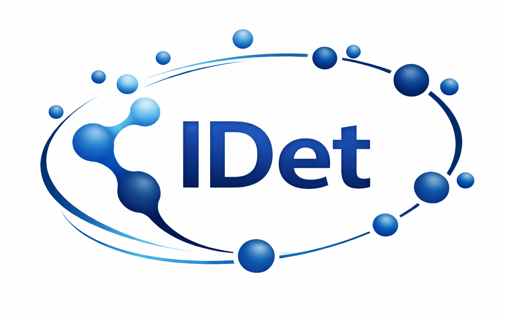
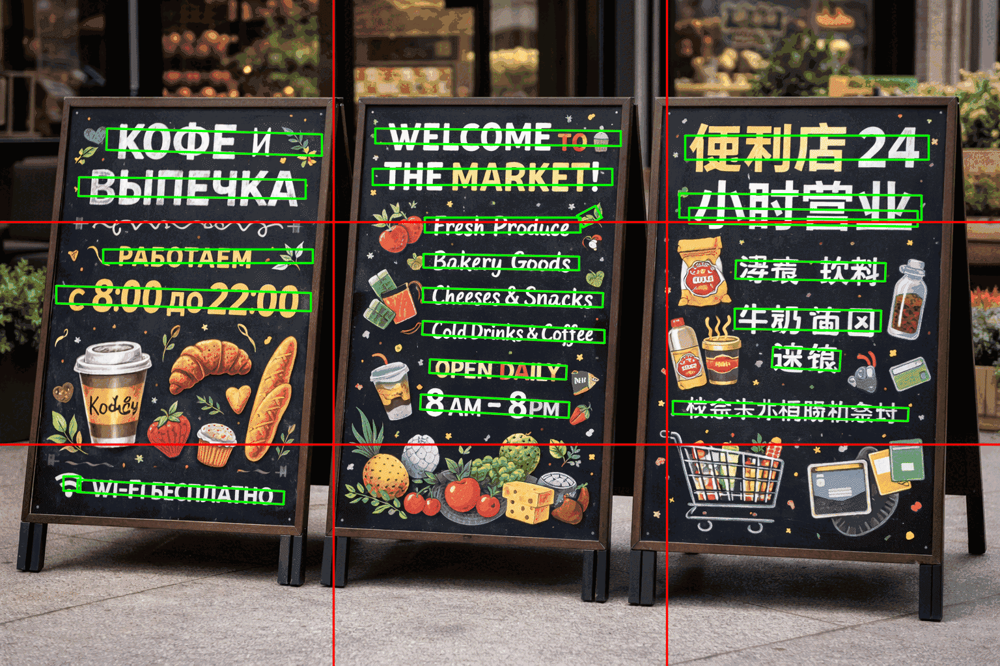
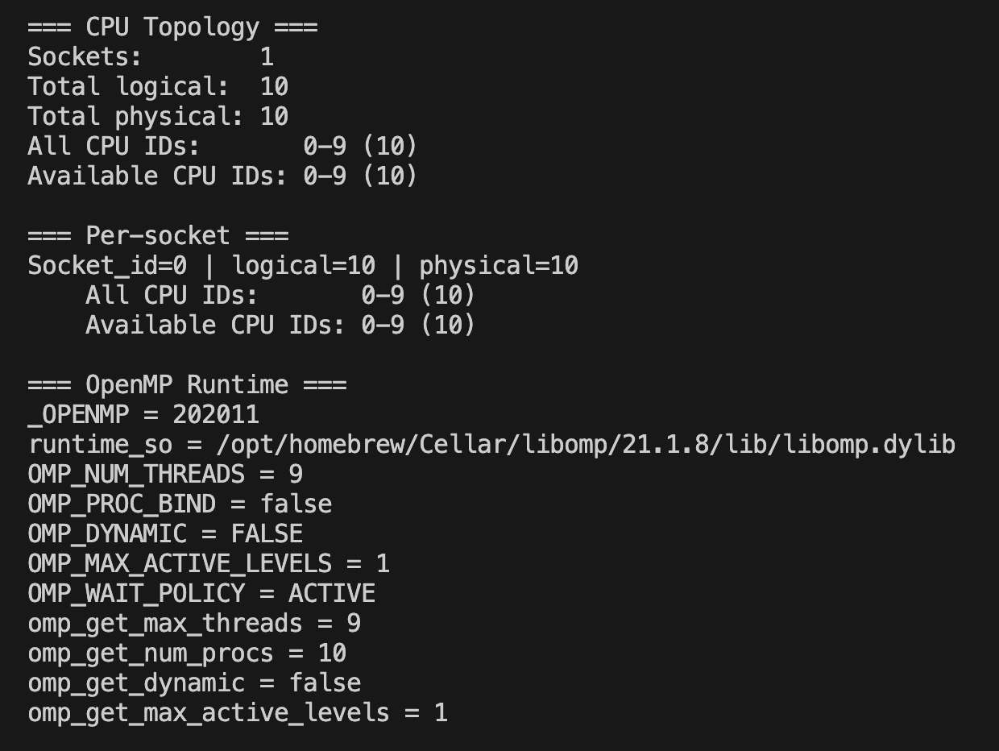
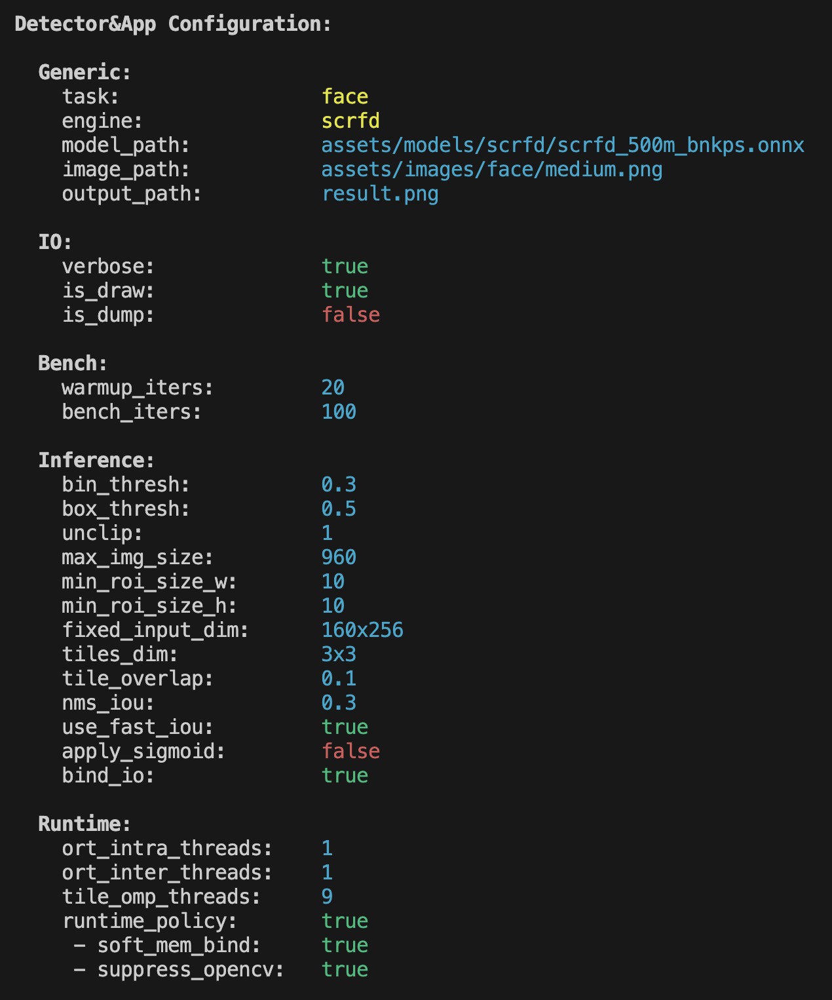
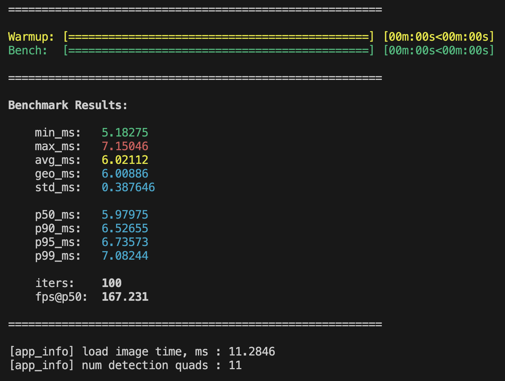

# Fast CPU-only ROI Detection Library 🚀 

[](https://en.cppreference.com/w/cpp/17) 
[](https://opencv.org/) 
[](https://onnxruntime.ai/) 
[](https://www.openmp.org/) 
[](https://github.com/numactl/numactl) 
[](https://mesonbuild.com/) 
[](#) 



**IDet** is a fast, production-oriented **CPU-only** C++ library for **image detection pipelines**, built on top of **ONNX Runtime**. Library supports two modes: **text detection** (DBNet / PP-OCR-style models) and **face detection** (SCRFD family). Key features include **tiled inference**, **polygon NMS**, **IOBinding** (zero per-frame allocations), explicit **threading/memory control**, and **reproducible performance profiles** for modern multi-core CPUs. Demo application contains stunning **performance report** with p50/90/95/99 latency, runtime policy and detector configuration details. 
 
## Table of Contents 
 
- [Highlights](#highlights) 
- [Project Scope](#project-scope) 
- [Requirements](#requirements) 
    - [Linux (Ubuntu / Debian)](#linux-ubuntu--debian) 
    - [MacOS (Apple Silicon / Intel)](#macos-apple-silicon--intel) 
- [Build Profiles](#build-profiles) 
    - [Profiles](#profiles) 
    - [Environment](#environment) 
    - [Setup](#setup) 
- [Install & Build](#install--build) 
    - [Install ONNX Runtime](#install-onnx-runtime) 
        - [System Install](#1-system-install-macos-only-homebrew) 
        - [From Sources](#2-build-from-sources-both-os-cpu--mlas) 
        - [Via Meson Wrap](#3-via-meson-wrap-prefered) 
    - [Build Project](#build-project) 
- [Model Zoo](#model-zoo) 
    - [MMOCR](#mmocr) 
    - [PaddleOCR](#paddleocr)
    - [DBNet / DBNet++](#dbnet--dbnet) 
    - [SCRFD](#scrfd) 
    - [Compatibility Notes](#compatibility-notes) 
- [Command-line Options](#command-line-options) 
    - [Required](#required) 
    - [Generic](#generic) 
    - [Inference](#inference) 
    - [Runtime](#runtime) 
    - [Benchmark](#benchmark)   
    - [Help](#help) 
- [Quick Start](#quick-start) 
    - [Text Detection](#text-detection) 
    - [Face Detection](#face-detection) 
- [Performance Report](#performance-report) 
- [Performance Tuning Guide](#performance-tuning-guide) 
- [IOBinding Deep-Dive](#iobinding-deep-dive) 
- [Tiling & NMS](#tiling--nms) 
- [Troubleshooting](#troubleshooting) 
- [FAQ](#faq) 


## Highlights 

- ⚡ **High-performance CPU inference** (x86 / ARM, MacOS & Linux) 
- 🧠 **Multiple pipelines**: text detection, face detection 
- 🧩 **Tiled inference** (RxC grid) with overlap + polygonal NMS 
- 💾 **IOBinding**: reusable buffers, zero allocations per frame
- 📈 **Bench mode**: p50 / p90 / p95 / p99 latency 
- 🔒 **Accurate logging & error handling**: all interaction goes through wrappers 
- 🔧 **Explicit threading model**: 
    - OpenMP → outer parallelism (tiles / batches) 
    - ONNX Runtime → intra-op graph execution 
    

## Project Scope 

**IDet** is designed as a **low-level inference toolkit**, not an end-to-end OCR or face recognition system, which intentionally focuses on: 

  - predictable latency 
  - CPU efficiency 
  - explicit memory ownership 
  - minimal dependencies 
  - clean C++ integration 
    

## Requirements 

| Component | Minimum | Scope | Requirement | Notes | 
|:---|:---:|:---:|:---:|:---| 
| **C++ toolchain** | **C++17** | Build | 🟢 | Any GCC/Clang that fully supports C++17 | 
| **Meson** | — | Build | 🟢 | Primary build system (typically uses Ninja as backend) | 
| **pkg-config** | — | Build | 🟢 | Used to discover system dependencies (OpenCV / ORT, etc.) | 
| **OpenCV** | **3.0+** | Runtime | 🟢 | Modules: `core`, `imgproc`, `imgcodecs` | 
| **ONNX Runtime (CPU / MLAS)** | — | Runtime | 🟢 | Can be provided via `system install`, `meson wrap` or `source build` | 
| **CMake** | **≥ 3.18** | Build | 🟡 | Needed **only** if ONNX Runtime is built from sources / via wrap (depends on ORT version) | 
| **OpenMP runtime** | — | Runtime | 🟡 | Recommended for tiling / parallelism (Linux: often via `libomp-dev` for Clang; MacOS: `libomp`) | 
| **NUMA** | — | Runtime | 🔵 | Optional; **Linux-only** (multi-socket topology / affinity; typically `libnuma-dev`) | 

> **Legend:** required (🟢), recommended / conditional (🟡), optional (🔵) 

### Linux (Ubuntu / Debian)

```bash
sudo apt-get update
sudo apt-get install -y \
    build-essential ninja-build meson pkg-config python3 \
    python3-pip libopencv-dev libnuma-dev libomp-dev git
```

### MacOS (Apple Silicon / Intel)

```bash
brew install \
    meson ninja opencv onnxruntime \
    libomp cmake python llvm
```

> 💡 **Note:** 
> Create a **virtual environment** for tooling in project root directory (optional but recommended):

> ```bash 
> python3 -m venv .venv
> source .venv/bin/activate
> python --version
> pip install -U pip
>```


## Build Profiles 

**IDet** supports explicit compiler profiles, allowing reproducible performance comparisons and easier tuning. 

### Profiles 

Profiles are defined in `toolchain/profiles` directory and control: 
- compiler (clang / gcc) 
- optimization flags 
- vectorization (where applicable) 
- warning levels and sanitizers 

### Environment 

The toolchain loader reads environment variables from: 

- `toolchain/env/defaults.env` — **repository defaults** (committed). 
  Defines baseline settings and may provide a default `TC_PROFILE` plus generic tool names / behavior defaults.

- `toolchain/env/local.env` — **optional local/repo overrides** (not required; may be committed in this repository). 
  Use it for custom `TC_PROFILE`, tool paths, package locations, or anything specific to your machine/repo clone.
  
> 💡 **Note:** In other words `local.env` overrides `defaults.env`, and an explicitly chosen profile overrides both. 

### Setup 

The toolchain is designed to be **sourced once per terminal session**. It sets up a reproducible build environment: selected compiler, tool versions, Meson native file and default build directory. 

> ⚠️ **Warn:** `toolchain/scripts/*.sh` must be sourced from **bash** (not zsh). On macOS, run `bash` first, then `source <cmd>`.

1) List available profiles:
    ```bash 
    source toolchain/scripts/tc.sh
    tc_list
    ```

2) Choose the one you like:
    ```bash
    source toolchain/scripts/activate.sh <profile>
    # or see usage:
    source toolchain/scripts/activate.sh -h
    ```

3) Next run building / benching / etc. :
    ```bash
    scripts/build.sh
    scripts/run_idet_text.sh
    # ...
    ```

> ⚠️ **Warn:** scripts under `toolchain/scripts` directory must be **sourced**, not executed. They export environment variables into your current shell. 


## Install & Build 

### Install ONNX Runtime 

IDet supports **three** ways to provide ONNX Runtime (CPU / MLAS). From Meson’s point of view there are two modes: 

- **External ORT** (`-Donnxruntime_system=true`) 
  You provide headers/libs via Homebrew (macOS) or your own install (Linux/macOS from sources). 
- **Bundled ORT subproject** (`-Donnxruntime_system=false`, default) 
  ORT is built automatically via Meson **wrap/subproject**. 
  
Below are the **three** practical workflows: 

--- 

#### 1) System Install (MacOS only, Homebrew) 

This is the simplest way on MacOS:
```bash
brew install onnxruntime
```

Configure Meson to use the system ORT or change `meson_options.txt` in root directory:
```bash
./scripts/build.sh setup -- -Donnxruntime_system=true
```

If Meson cannot locate ORT via its CMake package, provide paths explicitly (these options are used **only** when the CMake package is not found):
```bash
ORT_PREFIX="$(brew --prefix onnxruntime)"
./scripts/build.sh setup -- -Donnxruntime_inc="${ORT_PREFIX}/include/onnxruntime" -Donnxruntime_lib="${ORT_PREFIX}/lib"
```

> 💡 **Note:** Prefer `$(brew --prefix onnxruntime)` over hardcoding `Cellar/...` because `opt/` is stable across upgrades. 

--- 

#### 2) Build From Sources (Both OS, CPU / MLAS) 

Use this if you want full control, or you’re on Linux without a good system package. A plain CPU build uses ONNX Runtime’s default CPU kernels (**MLAS**). No CUDA/TensorRT/etc.
```bash
git clone --recursive https://github.com/microsoft/onnxruntime.git
cd onnxruntime

# Optional but recommended: build a release tag instead of main
# git checkout v<version>

./build.sh --config Release --build_shared_lib --parallel --skip_submodule_sync
```

**Install headers/libs to a system prefix** (example: `/usr/local`). 

Headers:
```bash
sudo cp -r include/onnxruntime /usr/local/include/
```

Libraries (paths may vary by OS/config; find them first):
```bash
find build -maxdepth 4 -type f \( -name "libonnxruntime.so*" -o -name "libonnxruntime.dylib" \) -print
```

Then copy them:
```bash
# Linux example
sudo cp -d build/Linux/Release/libonnxruntime.so* /usr/local/lib/
sudo cp -d build/Linux/Release/libonnxruntime_providers_shared.so /usr/local/lib/ 2>/dev/null || true
sudo ldconfig

# MacOS example
sudo cp -d build/MacOS/Release/libonnxruntime.dylib /usr/local/lib/
```

Now tell **IDet** to use external ORT:
```bash
./scripts/build.sh setup -- -Donnxruntime_system=true
```

If discovery fails, specify paths explicitly:
```bash
./scripts/build.sh setup -- -Donnxruntime_inc="/usr/local/include/onnxruntime" -Donnxruntime_lib="/usr/local/lib"
```

> 💡 **Note:** building ORT from sources (or via wrap) may require a newer CMake depending on the ORT tag. If ORT build fails, upgrade CMake or pin an older ORT tag.
 
--- 

#### 3) Via Meson Wrap (prefered) 

This is the most reproducible option and requires no system ORT installation. By default, IDet builds ONNX Runtime as a **bundled subproject** (via `subprojects/*` wrap config):
```bash
./scripts/build.sh setup  # default: -Donnxruntime_system=false -Donnxruntime_inc='' -Donnxruntime_lib=''
```

> 💡 **Note:** 
> - First build may take longer (ORT is built as part of the project) 
> - This mode may still require **CMake** on the host to build ORT (depending on the wrap/ORT version) 


### Build Project 

Once all **dependencies** are resolved, the **environment/profile** is configured, and the **ONNX Runtime** installation path is selected, you can begin building the **IDet** library and their **demo CLI application** to demonstrate its functionality. 

Let's go through all steps again using the example of building all deoendencies via **Meson wrap**: 

#### 1) Activate default profile

```bash
source toolchain/scripts/activate.sh
```

#### 2) Build all targets
```bash
./scripts/build.sh force -- -Didet_libtype="shared"
```

> 💡 **Note:** 
> `idet_libtype` controls what kind of **IDet** library artifacts Meson builds: 
> - `shared` — build **only** the shared library (`*.so` / `*.dylib`) 
> - `static` — build **only** the static library (`*.a`) 
> - `both` — build **both** shared **and** static variants 

#### 3) Run tests 

Tests are enabled via Meson option `build_tests`. If you (or profile policy) disabled them earlier, reconfigure the build first:
```bash
./scripts/build.sh f -- -Dbuild_tests=true
```

Then run the test suite:
```bash
./scripts/run_tests.sh
```

#### 4) Run developer tools 

Common helper scripts:
```bash
./scripts/format_code.sh
./scripts/clang_static_analyzer.sh
./scripts/include_cleaner.sh
```

> 💡 **Note:** Every script supports `-h` / `--help` with usage details and available flags. 


## Model Zoo 

This project is **model-agnostic** as long as your detector exports a single-channel probability (or logit) map. Below are several practical sources of ready-to-use models. 

### MMOCR 

MMOCR provides many detectors (R50, MobileNet, DCN variants, etc.). You can export them to ONNX and use them directly with this tool. Detailed information about available models you can find there: [mmocr_models](https://mmocr.readthedocs.io/en/dev-1.x/textdet_models.html). Also, take a look on support in ONNX Runtime: [mmocr_support](https://mmdeploy.readthedocs.io/en/latest/04-supported-codebases/mmocr.html). 

**Export with MMOCR’s `pytorch2onnx.py`** 

1) Clone and install MMOCR (use versions compatible with your checkpoint):
    ```bash
    git clone https://github.com/open-mmlab/mmocr.git
    cd mmocr
    python3.11 -m venv mvenv
    source ./mvenv/bin/activate
    pip install -r requirements.txt
    pip install onnx onnxsim
    ```

2) Export to ONNX:
    ```bash
    python tools/deployment/pytorch2onnx.py <CONFIG.py> \
        --checkpoint <MODEL.pth> \
        --output-file <OUT.onnx> \
        --opset 11 --dynamic-export
    ```

3) (Optional) Simplify the graph:
    ```bash
    python -m onnxsim <OUT.onnx> <OUT-sim.onnx>
    ```

> 💡 **Notes & tips:** 
> - Prefer **opset ≥ 11**. For CPU inference, 11–13 is typically safe. 
> - If you need dynamic spatial sizes, keep `--dynamic-export`; otherwise static shapes plus `--fixed_hw` may be faster/stabler. 
> - Some MMOCR configs already include the final **Sigmoid** in the head. If your output looks like logits, run with `--sigmoid 1`. 
> - Keep input channels at 3 unless you **change the first conv to 1-channel** and re-train/fine-tune (grayscale alone rarely gives a big speedup). 

> If you prefer **MMDeploy**, you can export via MMDeploy’s ONNX pipeline as well: just ensure the resulting model outputs a single-channel map and that pre/post-processing matches what this app expects. 

### PaddleOCR 

There are pre-converted **PaddleOCR** detectors on the Hugging Face Hub: [deepghs/paddleocr](https://huggingface.co/deepghs/paddleocr/tree/main). The collection includes multiple **PP-OCR** detector generations (v2/v3/v4), including lightweight **mobile** variants and higher-accuracy **server** variants. Typical model names you can find in `assets/models/paddleocr` directory: 

- `ch_ppocr_v2_det.onnx`
- `ch_ppocr_v2_mobile_det.onnx` 
- `ch_ppocr_v2_mobile_slim_det.onnx` 
- `ch_ppocr_v2_server_det.onnx` 
- `ch_ppocr_v3_det.onnx` 
- `en_ppocr_v3_det.onnx` 
- `ch_ppocr_v4_det.onnx`
- `ch_ppocr_v4_server_det.onnx` 

### DBNet / DBNet++ 

If you want to test “classic” **DBNet / DBNet++** models (e.g., **1200e** trained checkpoints on **ICDAR2015**), the Hugging Face Hub repo by **deepghs** provides ready-to-use ONNX exports: [deepghs/text_detection](https://huggingface.co/deepghs/text_detection/tree/main). You can find multiple backbone variants, including **ResNet-18** and **ResNet-50** FPNC-style models, where some of these models may already be available in `assets/models/dbnet` directory: 

- `dbnet_resnet_18_fpnc.onnx` 
- `dbnet_resnet_50_dcnv2_fpnc.onnx` 

### SCRFD 

There are pre-converted **SCRFD** face detectors on the Hugging Face Hub: [ykk648/face_lib](https://huggingface.co/ykk648/face_lib/tree/main/face_detect/scrfd_onnx). The repo includes multiple SCRFD variants (from lightweight to higher-accuracy backbones). SCRFD models typically output **face bounding boxes + confidence scores**, and many variants also predict **5 facial landmarks** (eyes / nose / mouth corners). In model names, bnkps commonly indicates **bboxes + keypoints**. Typical model names you can find in `assets/models/scrfd` directory: 

- `scrfd_500m_bnkps.onnx` 

### Compatibility Notes 

- **Output often contains logits** → run with `--sigmoid 1`. 
- **Normalization differs from ImageNet**: PaddleOCR commonly uses `img = (img/255.0 - 0.5) / 0.5` (i.e., `mean=(0.5,0.5,0.5)`, `std=(0.5,0.5,0.5)`). 
  The current code uses ImageNet stats (`mean=(0.485,0.456,0.406)`, `std=(0.229,0.224,0.225)`). For best accuracy with Paddle models, **adjust the normalization in code** to Paddle’s scheme or re-export to match ImageNet stats. 
- **Input sizes** are typically dynamic with the constraint **H,W % 32 == 0**. Use `--fixed_hw` (e.g., `640x640`) to meet that requirement. 
- If you see `Unexpected output shape`, your detector might output a different tensor layout. This app handles `[1,1,H,W]`, `[1,H,W,1]`, `[1,H,W]`, and `[H,W]`. If yours differs, inspect the model head or adjust the post-processing accordingly. 

> 💡 **Notes & tips:** 
> - If you switch to Paddle normalization, update mean / std in code accordingly. 
> - For highest stability in batch/production (hundreds of images): combine **IOBinding** (`--bind_io 1`) with a **fixed input size** (`--fixed_hw`) and keep ORT threads small (`--threads_intra 1–2`) while scaling tiles via OpenMP (`--tile_omp`). 


## Command-line Options 

> 💡 **Note:** These flags belong to the **demo CLI application** (e.g. `idet_app`) that links against the **IDet library**. Use the CLI for quick sanity checks, visualization, and benchmarking; in production you typically integrate the library directly via its C++ API. 

### Required 

| Flag | Type | Default | Mode | Description | 
|:---|:---:|:---:|:---:|:---| 
| `--model` | STR | — | All | ONNX model path | 
| `--mode` | STR | — | All | Detector mode: `text` \| `face` | 
| `--image` | STR | — | All | Input image path | 

### Generic 

| Flag | Type | Default | Mode | Description | 
|:---|:---:|:---:|:---:|:---| 
| `--is_draw` | 0\|1 | `1` | All | Draw detections on image | 
| `--is_dump` | 0\|1 | `1` | All | Write/save output image | 
| `--output` | STR | `result.png` | All | Output image path (when `--is_draw=1`) | 
| `--verbose` | 0\|1 | `0` | All | Verbose logging | 

### Inference 

| Flag | Type | Default | Mode | Description | 
|:---|:---:|:---:|:---:|:---| 
| `--bin_thresh` | F | `0.3` | Text | Binarization threshold | 
| `--box_thresh` | F | `0.5` | Text | Box score threshold | 
| `--unclip` | F | `1.0` | Text | Unclip ratio | 
| `--max_img_size` | N | `960` | All | Max side length for non-tiling inference | 
| `--min_roi_size_w` | N | `5` | All | Minimal ROI width | 
| `--min_roi_size_h` | N | `5` | All | Minimal ROI height | 
| `--tiles_rc` | RxC | `off` | All | Enable tiling grid (e.g. `2x2`, `3x4`). Disable: `off`\|`no`\|`0` | 
| `--tile_overlap` | F | `0.1` | All | Tile overlap fraction | 
| `--nms_iou` | F | `0.3` | All | NMS IoU threshold | 
| `--use_fast_iou` | 0\|1 | `0` | All | Fast IoU option for NMS / overlap checks | 
| `--sigmoid` | 0\|1 | `0` | All | Apply sigmoid on output map (useful if model outputs logits) | 
| `--bind_io` | 0\|1 | `0` | All | Use ORT I/O binding (buffer reuse) | 
| `--fixed_hw` | HxW | `off` | All | Fixed input size (e.g. `480x480`). Disable: `off`\|`no`\|`0` | 

### Runtime 

| Flag | Type | Default | Mode | Description | 
|:---|:---:|:---:|:---:|:---| 
| `--threads_intra` | N | `1` | All | ORT intra-op threads (inside operators) | 
| `--threads_inter` | N | `1` | All | ORT inter-op threads (between graph nodes) | 
| `--tile_omp` | N | `1` | All | OpenMP threads for tiling | 
| `--runtime_policy` | 0\|1 | `1` | All | Setup runtime policy (CPU/mem binding + OpenCV suppression) | 
| `--soft_mem_bind` | 0\|1 | `1` | All | Best-effort memory locality (when supported) | 
| `--suppress_opencv` | 0\|1 | `1` | All | Limit OpenCV global thread count to 1 | 

### Benchmark 

| Flag | Type | Default | Mode | Description | 
|:---|:---:|:---:|:---:|:---| 
| `--bench_iters` | N | `100` | — | Benchmark iterations | 
| `--warmup_iters` | N | `20` | — | Warmup iterations (excluded from stats) | 

### Help 

| Flag | Type | Default | Mode | Description | 
|:---|:---:|:---:|:---:|:---| 
| `-h`, `--help` | — | — | — | Show usage message | 

--- 

> ⚠️ **Warn:** each detection is reported as a quadrilateral (4-point polygon) using **four vertices in TL → TR → BR → BL order** (clockwise), where `(x0,y0)=TL`, `(x1,y1)=TR`, `(x2,y2)=BR`, `(x3,y3)=BL`:
```text
x0,y0 x1,y1 x2,y2 x3,y3
``` 


## Quick Start 

**IDet** ships a **demo CLI app** (`idet_app`) that supports several detection modes: **Text**, **Face**. Each mode is launched by its own wrapper shell script, where you can override the default behavior by changing the parameters if desired. Let's look at each of them separately. 

> ⚠️ **Warn:** The images below are for **illustration only** and do not reflect detection quality. Actual results depend on many factors, including the chosen model (architecture/size), input resolution, and pre-/post-processing settings (thresholds, unclip, NMS, etc.)! 

### Text Detection 

#### 1) Basic single-shot detection:
```bash
./scripts/run_idet_text.sh
```
 

#### 2) Detection with tiling:
```bash
./scripts/run_idet_text.sh tile
```
 

### Face Detection 

#### 1) Basic single-shot detection:
```bash
./scripts/run_idet_face.sh
```
 

#### 2) Detection with tiling:
```bash
./scripts/run_idet_face.sh tile
```
 


## Performance Report 

The **demo CLI app** (`idet_app`) can run a warmup + benchmark loop and prints a detailed **performance report**: 

### Runtime Policy 

- **CPU topology** (sockets, logical/physical cores, available CPU IDs)
- **Affinity verification** and the allowed CPU mask (when runtime policy / binding is enabled) 
- **OpenMP affinity** (effective threads, environment variables) 

 

### Configuration 

Effective application and detector configuration: 

 

### Results 

- Progress bars for warmup and benchmark loops 
- Benchmark results 

 


## Performance Tuning Guide 

- **Two levels of parallelism**: 
  - **OpenMP (outer)** = `--tile_omp` (or `OMP_NUM_THREADS`) → parallel tiles. 
  - **ONNX Runtime (inner)** = `--threads_intra` → parallel inside a tile. 

- **Thresholds**: 
  - `--bin_thresh` usually 0.2–0.4, `--box_thresh` 0.5–0.7. 
  - For small objects, increase `--max_img_size` or use tiling with overlap `0.10–0.20`. 

- **Avoid oversubscription**: on large CPUs, prefer **many tiles** (`--tile_omp`) and **few ORT threads** (`--threads_intra 1–2`). 

- **IOBinding**: enable `--bind_io 1`; ideally combine with `--fixed_hw HxW` (multiple of 32) to **never re-bind**. 


## IOBinding Deep-Dive 

**What it is**: binding ONNX input / output tensors directly to your **pre-allocated** buffers. 
**Why it matters**: eliminates per-frame allocations & copies, improving latency stability. 

**Best practice**: 
- Set `--bind_io 1`. 
- Use **fixed shapes** with `--fixed_hw HxW` (rounded to /32). 
- With tiling, each OpenMP worker gets its **own binding context** (no locks). 


## Tiling & NMS 

- `--tiles_rc RxC` splits the image into a grid and runs inference per tile. 
- `--tile_overlap` avoids cutting objects at tile borders. 
- After stitching, **polygon NMS** removes duplicate boxes across tiles using IoU (typical `0.2–0.4`). 

> 💡 **Note:** For heavy servers: tiling scales extremely well with OpenMP (outer) threads. Keep ORT threads small. 


## Troubleshooting 

- **`onnxruntime_cxx_api.h: No such file or directory`** 
Make sure ONNX Runtime is installed and headers are visible to Meson (e.g., `/usr/local/include` on Linux, `/opt/homebrew/opt/onnxruntime/include` on MacOS). 

- **`Unexpected output shape`** 
This tool supports `[1,1,H,W]`, `[1,H,W,1]`, `[1,H,W]`, `[H,W]`. If your model differs, verify your export and the final layers. If outputs are **logits** (not in [0,1]), pass `--sigmoid 1`. 

- **Performance flatlines when increasing threads** 
Likely oversubscription. Lower `--threads_intra` (ORT) to 1–2; increase `--tile_omp`. 

- **Boxes are weak or too many false positives** 
Tune `--bin_thresh`, `--box_thresh`, `--unclip`. If model lacks final sigmoid, set `--sigmoid 1`. 


## FAQ 

**Q:** Can I speed up by feeding grayscale instead of RGB?  
**A:** Not unless the **model itself** is changed to accept `[1,1,H,W]`. Feeding one channel into `[1,3,H,W]` doesn’t reduce compute. Changing the first conv to 1-channel helps only a little overall; accuracy may drop. 

**Q:** How are coordinates printed?   
**A:** Each detection line on **stdout**: `x0,y0 x1,y1 x2,y2 x3,y3` (ordered clockwise). 

**Q:** Does the tool support dynamic sizes?  
**A:** Yes. Dynamic path uses `--max_img_size`. For best latency and zero re-binding, prefer `--fixed_hw HxW` with `--bind_io 1`. 

### Credits 

This project uses such libraries / frameworks: 
  - **OpenCV** (image data processing) 
  - **OpenMP** (fast tiled inference) 
  - **ONNX Runtime** (inference engine) 
  - **NUMA** (cpu/mem binding topology for multi-socket nodes) 
  - **GTest** (test coverage) 
  - **Indicators** (pretty output) 

Supported model families: 
- **DBNet** / **DBNet++** / **PP-OCR** (text detection) 
- **SCRFD** (face detection) 

--- 

👾 **Happy detecting!** 👾 

🔝 [Back to top](#table-of-contents)
