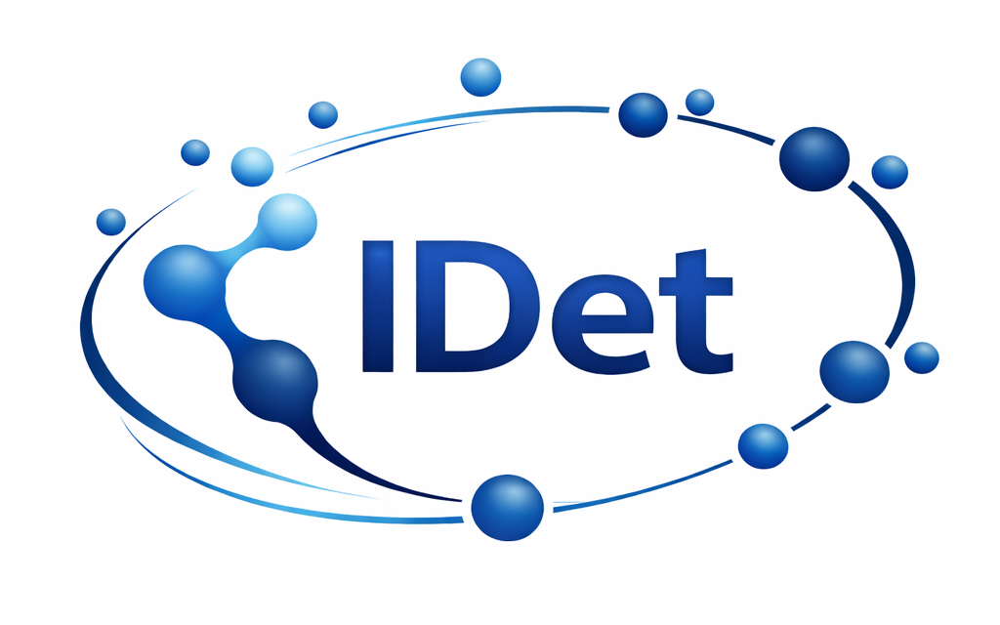

<h1 align="center">IDet</h1>

<p align="center"><strong>Fast CPU-only ROI Detection Library for Real-Time Pipelines 🚀</strong></p>

<p align="center">
  <a href="https://en.cppreference.com/w/cpp/17">
    
  </a>
  <a href="https://opencv.org">
    
  </a>
  <a href="https://www.openmp.org">
    
  </a>
  <a href="https://github.com/numactl/numactl">
    
  </a>
  <a href="https://mesonbuild.com">
    
  </a>
  <a href="https://github.com/google/googletest">
    
  </a>
  <a href="#">
    
  </a>
</p>

<p align="center">
  <a href="https://onnxruntime.ai">
    
  </a>
  <a href="assets/models/dbnet">
    
  </a>
  <a href="assets/models/scrfd">
    
  </a>
  <a href="assets/models/yolo">
    
  </a>
</p>

<p align="center">
  
</p>


## Overview

**IDet** is a fast, production-oriented CPU-only C++ library for image detection pipelines, built on top of ONNX Runtime. Library supports three modes: `text detection` (DBNet / DBNet++ / PP-OCR-style models), `face detection` (SCRFD family) and `cloth detection` (YOLO family). Key features include tiled inference, polygon NMS, IOBinding (zero per-frame allocations), explicit threading and memory control, and reproducible performance profiles for modern multi-core CPUs.


## Why IDet?

Most demo repos optimize for “it runs”. **IDet** optimizes for:

- **CPU-first deployment**
- **reproducible performance experiments**
- **low allocation churn**
- **controllable threading**
- **maintainable C++ integration**
- **model-agnostic detector pipelines (within supported output contracts)**

This makes **IDet** suitable for:
- server-side CPU inference
- embedded-ish x86 / ARM deployments (when GPU is not available or not desired)
- benchmarking and systems-level performance tuning
- integrating detection into larger C++ products


## Documentation

Detailed documentation is organized into focused, self-contained pages under `docs/`:

| Page | What it covers |
|:---|:---|
| [Requirements](docs/requirements.md) | Host dependencies for Linux/macOS and project scope |
| [Build & Install](docs/build.md) | Toolchain profiles, ORT setup, Meson options, build/test/install flow |
| [Model Zoo](docs/model-zoo.md) | Supported model families, conversion notes, compatibility rules |
| [Command-line Options](docs/cli.md) | Actual `idet_app` flags, defaults, validation rules |
| [Quick Start](docs/quick-start.md) | Text / face / cloth scripts and direct smoke commands |
| [C++ Integration Guide](docs/integration.md) | Blocking API, hot-loop worker, image lifetime, fixed-shape IOBinding |
| [Performance Guide](docs/performance.md) | Runtime policy, benchmark output, tuning, IOBinding, tiling and NMS |
| [Troubleshooting & FAQ](docs/troubleshooting.md) | Common failures, ORT ABI mismatch, FAQ |


## Quick Start

```bash
source toolchain/activate.sh
scripts/build.sh force -- -Didet_libtype=shared
scripts/run_tests.sh
scripts/run_idet_text.sh
```

Build the checked C++ integration examples:

```bash
scripts/build.sh force -- -Dbuild_examples=true
```

Then run, from repository root:

```bash
"${BUILD_DIR}/examples/sync_detector"
"${BUILD_DIR}/examples/hot_loop_worker"
```


## Highlights

- ⚡ **High-performance CPU inference** (x86 / ARM, Linux & MacOS)
- 🧠 **Multiple detection pipelines**: text, face, and cloth detection
- 🧩 **Tiled inference** (`RxC`) with overlap for small-object recall
- 📐 **Polygon-based post-processing** with NMS
- 💾 **ONNX Runtime IOBinding** for reusable input/output buffers
- 📈 **Benchmark mode** with p50 / p90 / p95 / p99 latency
- 🔒 **Accurate logging & error handling:** all interaction goes through wrappers
- 🧵 **Explicit threading model:**
    - OpenMP → outer parallelism (tiles / batches)
    - ONNX Runtime → intra-op / inter-op graph execution
- 🔧 **Runtime policy controls:**
    - affinity / topology-aware execution (where supported)
    - optional NUMA memory locality helpers
    - OpenCV thread suppression to avoid oversubscription


## Project Scope

**IDet** is intentionally a **low-level inference toolkit**, not a full OCR stack or face recognition framework.

### In scope
- ONNX Runtime-based CPU detector execution
- pre-processing / post-processing for supported detector families
- tiled inference and result stitching
- performance benchmarking and runtime policy control
- library integration + CLI demo tooling

### Out of scope
- OCR text recognition and language models
- ROI recognition / embeddings / tracking
- dataset labeling / training pipelines
- GUI applications


## Credits

This project uses such libraries / frameworks:
  - **OpenCV** (image data processing, isolated behind adapters in library internals)
  - **OpenMP** (fast tiled inference)
  - **ONNX Runtime** (inference core engine)
  - **NUMA** (cpu/mem binding topology for multi-socket nodes)
  - **GTest** (test coverage)
  - **Indicators** (pretty output with progress bar)

Supported model families:
- **DBNet** / **DBNet++** / **PP-OCR** (text detection)
- **SCRFD** (face detection)
- **YOLO** (cloth detection)

🔝 [Back to documentation](#documentation)
