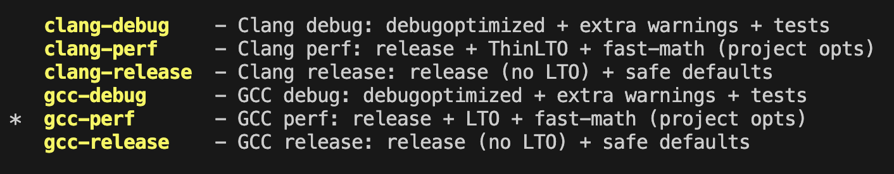
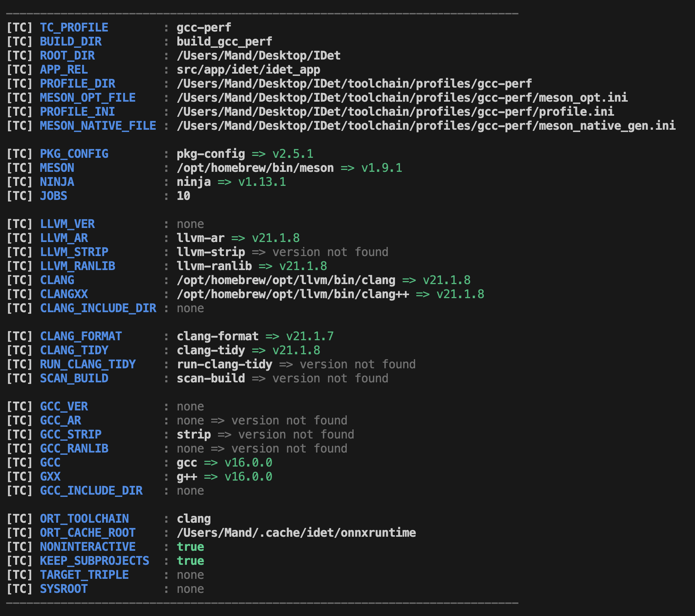

# Build & Install

[Back to README](../README.md) | [Documentation index](index.md) | Previous: [Requirements](requirements.md) | Next: [Model Zoo](model-zoo.md)

**IDet** supports reproducible toolchain profiles, multiple ONNX Runtime discovery modes, shared/static library builds, tests, examples, and install into a custom prefix.


## Build Profiles

Profiles are defined in `toolchain/profiles` directory and control:
- compiler (clang / gcc)
- optimization flags
- vectorization (where applicable)
- warning levels and sanitizers

The toolchain loader reads environment variables from:

- **[toolchain/env/defaults.env](../toolchain/env/defaults.env)** — repository defaults (committed).
- `toolchain/env/local.env` — optional local/repo overrides.

> 💡 **Note:** `local.env` overrides `defaults.env`, and an explicitly chosen profile overrides both.


## Setup

The toolchain is designed to be **sourced once per terminal session**.

> 💡 **Note:** **[toolchain/activate.sh](../toolchain/activate.sh)** must be **sourced** (not executed) — it exports environment variables into your current shell. Both `bash` and `zsh` are supported. **[toolchain/tc.sh](../toolchain/tc.sh)** is the bash-only implementation file; zsh users should enter through `activate.sh`.

List available profiles:

```bash
# bash
source toolchain/tc.sh && tc_list

# zsh (or bash)
source toolchain/activate.sh && tc_list
```

<table align="center" width="70%">
  <tr>
  <td align="center">
  
  <br>
  <sub>Terminal screenshot of a build preset selection menu showing Clang/GCC debug, perf, and release configurations, with <code>gcc-perf</code> selected.</sub>
  </td>
  </tr>
</table>

Choose a specific profile:

```bash
source toolchain/activate.sh <profile>
tc_print
```

<table align="center" width="70%">
  <tr>
  <td align="center">
  
  <br>
  <sub>Terminal screenshot of a toolchain profile summary for the selected <code>gcc-perf</code> configuration, listing resolved paths, detected tool versions, compiler availability, and runtime settings.</sub>
  </td>
  </tr>
</table>

Useful scripts:

| Script | Alias | Description |
|:---|:---|:---|
| [build.sh](../scripts/build.sh) | `idet-build` | Project builder via Meson |
| [run_tests.sh](../scripts/run_tests.sh) | `idet-test` | Run unit tests for library target |
| [format_code.sh](../scripts/format_code.sh) | `idet-fmt` | Formats C/C++ project sources in-place |
| [clang_static_analyzer.sh](../scripts/clang_static_analyzer.sh) | `idet-csa` | Clang static analyzer with soft and hard modes |
| [include_cleaner.sh](../scripts/include_cleaner.sh) | `idet-inc-clean` | Include directives cleaner util |
| [run_idet_text.sh](../scripts/run_idet_text.sh) | `idet-text` | Run text detection on test input data |
| [run_idet_face.sh](../scripts/run_idet_face.sh) | `idet-face` | Run face detection on test input data |
| [run_idet_cloth.sh](../scripts/run_idet_cloth.sh) | `idet-cloth` | Run cloth detection on test input data |

> 💡 **Note:** Every script supports `-h` / `--help` with usage details and available flags.


## ONNX Runtime Setup

IDet supports **three** ways to provide ONNX Runtime (CPU / MLAS):

- **External ORT** (`-Donnxruntime_system=true`)
  Meson tries pkg-config first, then CMake package discovery.
- **Manual ORT paths**
  Provide `-Donnxruntime_inc=...` and `-Donnxruntime_lib=...`.
- **Bundled ORT subproject** (`-Donnxruntime_system=false`, default)
  ORT is built automatically via Meson wrap.

### 1) System Install

MacOS Homebrew example:

```bash
brew install onnxruntime
scripts/build.sh setup -- -Donnxruntime_system=true
```

If discovery fails, provide paths explicitly:

```bash
ORT_PREFIX="$(brew --prefix onnxruntime)"
scripts/build.sh setup -- \
    -Donnxruntime_inc="${ORT_PREFIX}/include/onnxruntime" \
    -Donnxruntime_lib="${ORT_PREFIX}/lib"
```

> 💡 **Note:** Prefer `$(brew --prefix onnxruntime)` over hardcoding `Cellar/...` because `opt/` is stable across upgrades.

### 2) Build From Sources

Use this if you want full control, or you’re on Linux without a good system package. A plain CPU build uses ONNX Runtime’s default CPU kernels (**MLAS**). No CUDA/TensorRT/etc.

```bash
git clone --recursive https://github.com/microsoft/onnxruntime.git
cd onnxruntime

# Optional but recommended: build a release tag instead of main
# git checkout <version>

./build.sh --config Release --build_shared_lib --parallel --skip_submodule_sync
```

Install headers/libs to a system prefix:

```bash
sudo cp -r include/onnxruntime /usr/local/include/
find build -maxdepth 4 -type f \( -name "libonnxruntime.so*" -o -name "libonnxruntime.dylib" \) -print
```

Linux example:

```bash
sudo cp -d build/Linux/Release/libonnxruntime.so* /usr/local/lib/
sudo cp -d build/Linux/Release/libonnxruntime_providers_shared.so /usr/local/lib/ 2>/dev/null || true
sudo ldconfig
```

MacOS example:

```bash
sudo cp -d build/MacOS/Release/libonnxruntime.dylib /usr/local/lib/
```

Now tell **IDet** to use external ORT:

```bash
scripts/build.sh setup -- -Donnxruntime_system=true
```

### 3) Via Meson Wrap (preferred)

This is the most reproducible option and requires no system ORT installation. By default, **IDet** builds ONNX Runtime as a **bundled subproject** via Meson wrap. Select the appropriate `revision` in [subprojects/onnxruntime.wrap](../subprojects/onnxruntime.wrap) before installation.

```bash
scripts/build.sh setup
```

> 💡 **Note:**
> - First build may take longer (ORT is built as part of the project).
> - This mode may still require **CMake** on the host depending on the ORT version.


## Useful Meson Options

| Option | Type | Default | Description |
|:---|:---:|:---:|:---|
| `idet_libtype` | combo | `shared` | Build `shared`, `static`, or `both` IDet library variants |
| `idet_exe_link` | combo | `shared` | Link executables against shared/static IDet when `idet_libtype=both` |
| `onnxruntime_system` | bool | `false` | Use system-installed ONNX Runtime |
| `onnxruntime_inc` | string | empty | Manual ORT include dir |
| `onnxruntime_lib` | string | empty | Manual ORT library dir |
| `embed_onnx_models` | bool | `false` | Embed one ONNX model per supported detector into the library |
| `cpu_opt` | string | `native` | CPU tuning: `generic`, `native`, or target-specific value |
| `fast_math` | bool | `true` | Enable relaxed floating-point optimization flags |
| `thinlto` | bool | `true` | Hint Clang to use ThinLTO when `b_lto=true` |
| `use_openmp` | bool | `true` | Enable OpenMP for tile-level parallelism |
| `use_numa` | bool | `true` | Enable NUMA helpers when available |
| `install_rpath_extra` | string | empty | Extra install RPATH entries, colon-separated |
| `strict_warnings` | bool | `false` | Enable extra compiler warnings |
| `build_tests` | bool | `true` | Build unit tests |
| `build_examples` | bool | `false` | Build checked C++ integration examples |


## Build Project

Activate profile:

```bash
source toolchain/activate.sh
```

Build all default targets:

```bash
scripts/build.sh force -- -Didet_libtype="shared"
```

> 💡 **Note:** `idet_libtype` controls what kind of **IDet** library artifacts Meson builds:
> - `shared` — build only the shared library (`*.so` / `*.dylib`)
> - `static` — build only the static library (`*.a`)
> - `both` — build both shared and static variants

Run tests:

```bash
scripts/build.sh force -- -Dbuild_tests=true
scripts/run_tests.sh
```

Build examples:

```bash
scripts/build.sh force -- -Dbuild_examples=true
```

Install into a custom prefix:

```bash
meson setup /tmp/idet-install-build --prefix /tmp/idet-prefix -Dbuild_tests=true -Dbuild_examples=true
ninja -C /tmp/idet-install-build
meson install -C /tmp/idet-install-build
```


## Embed ONNX Models

IDet can bake one model per supported engine directly into the library, producing a self-contained artifact that needs no `assets/models/*.onnx` path at runtime.

Enable via:

```bash
scripts/build.sh force -- -Dembed_onnx_models=true
```

| Engine | Source file (must exist) | Define set when embedded |
|:---|:---|:---:|
| DBNet (text) | `assets/models/paddleocr/ch_ppocr_v2_det.onnx` | `IDET_HAVE_DBNET_EMBED` |
| SCRFD (face) | `assets/models/scrfd/scrfd_500m_bnkps.onnx` | `IDET_HAVE_SCRFD_EMBED` |
| YOLO (cloth) | `assets/models/yolo/yolov8n-kesimeg.onnx` | `IDET_HAVE_YOLO_EMBED` |

If a particular source file is missing, the build emits a warning and continues without embedding that engine's model — the binary will still need an external `--model` path for that engine.

🔝 [Back to top](#build--install)
