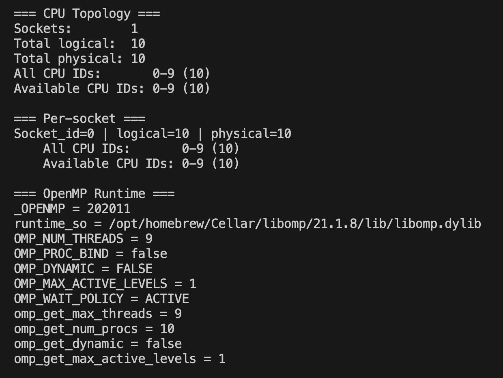
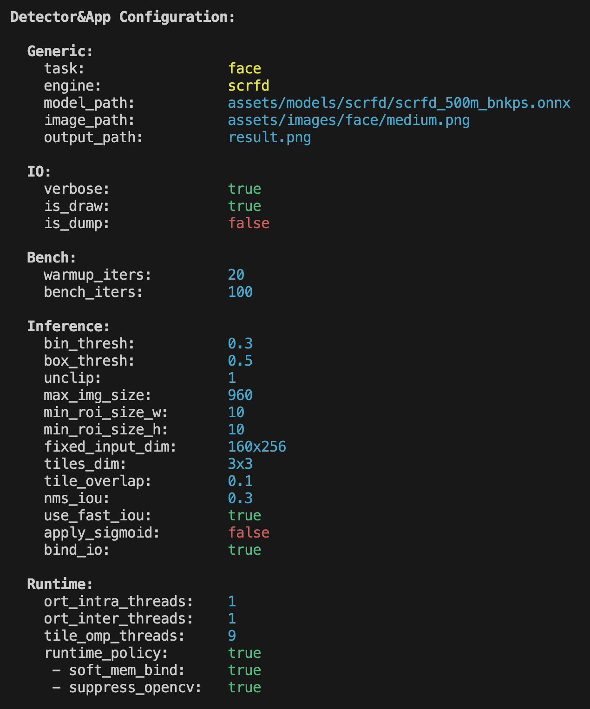
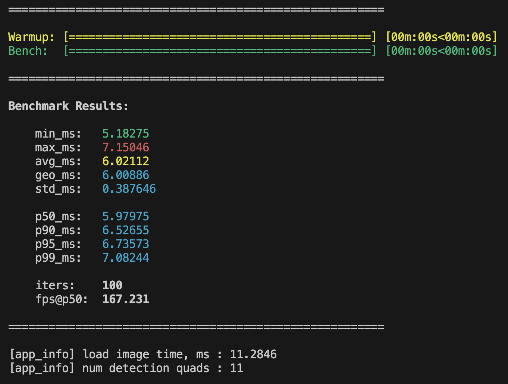

# Performance Guide

[Back to README](../README.md) | [Documentation index](index.md) | Previous: [C++ Integration](integration.md) | Next: [Troubleshooting & FAQ](troubleshooting.md)

The **demo CLI app** (`idet_app`) can run a warmup + benchmark loop and prints a detailed performance report with p50 / p90 / p95 / p99 latency.

## Runtime Policy

The report may include:

- CPU topology (sockets, logical/physical cores, available CPU IDs)
- affinity verification and allowed CPU mask (when runtime policy / binding is enabled)
- OpenMP affinity (effective threads, environment variables)

<table align="center" width="70%">
  <tr>
    <td align="center">
      
       
      Terminal screenshot of detected CPU topology and OpenMP runtime configuration, showing socket and core counts, available CPU IDs, libomp runtime details, and active threading settings.
    </td>
  </tr>
</table>

## Configuration

Effective application and detector configuration:

<table align="center" width="70%">
  <tr>
    <td align="center">
      
       
      Terminal screenshot of the detector and application configuration, showing the selected task and engine, input/output paths, benchmarking parameters, inference thresholds, tiling settings, and runtime threading options.
    </td>
  </tr>
</table>

## Results

- Progress bars for warmup and benchmark loops
- Benchmark results

<table align="center" width="70%">
  <tr>
    <td align="center">
      
       
      Terminal screenshot of benchmark execution and results, showing warmup and measurement progress bars together with latency statistics, percentile metrics, iteration count, estimated FPS, and basic application output.
    </td>
  </tr>
</table>

## Performance Tuning Guide

- **Two levels of parallelism**:
  - **OpenMP (outer)** = `--tile_omp` (or `RuntimePolicy::tile_omp_threads`) → parallel tiles.
  - **ONNX Runtime (inner)** = `--threads_intra` (or `RuntimePolicy::ort_intra_threads`) → parallel inside operators.

- **Thresholds**:
  - `--bin_thresh` usually 0.2–0.4, `--box_thresh` 0.5–0.7 for text/face.
  - YOLO-style cloth models often use `--box_thresh 0.25` and `--nms_iou 0.5`.
  - For small objects, increase `--max_img_size` or use tiling with overlap `0.10–0.20`.

- **Avoid oversubscription**:
  - On large CPUs, prefer many tiles (`--tile_omp`) and few ORT threads (`--threads_intra 1–2`).
  - The library avoids nested OpenMP in hot preprocessing/postprocessing loops when called from tiled inference.

- **IOBinding**:
  - Enable `--bind_io 1`.
  - Always combine it with `--fixed_hw HxW`; the core treats binding as a fixed-shape contract.

## IOBinding Deep-Dive

**What it is**: binding ONNX input / output tensors directly to reusable buffers.

**Why it matters**: reduces per-frame allocation churn and improves latency stability.

Best practice:

- Set `--bind_io 1`.
- Use fixed shapes with `--fixed_hw HxW`.
- With tiling, the detector prepares enough binding contexts for the configured tile workers
  (no shared bound buffers in the hot loop).
- With `DetectorWorker`, a single-flight lane usually needs one bound context.

## Tiling & NMS

- `--tiles_rc RxC` splits the image into a grid and runs inference per tile.
- `--tile_overlap` avoids cutting objects at tile borders.
- After stitching, polygon NMS removes duplicate boxes across tiles using IoU (typical `0.2–0.4` for text/face).

> 💡 **Note:** For heavy servers: tiling scales well with OpenMP outer threads. Keep ORT threads small unless model operators are the real bottleneck.
